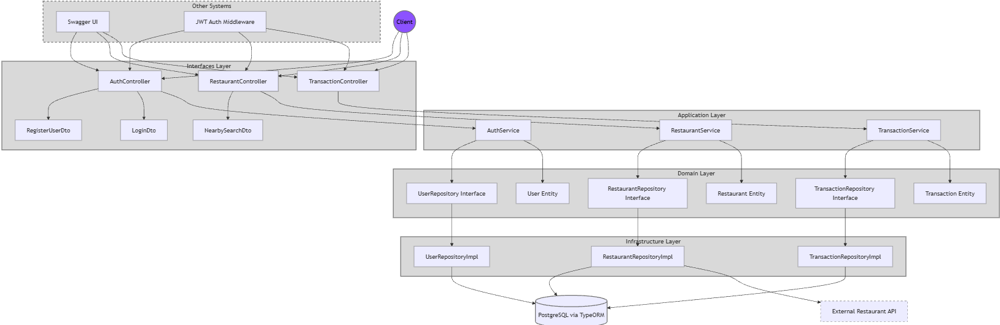
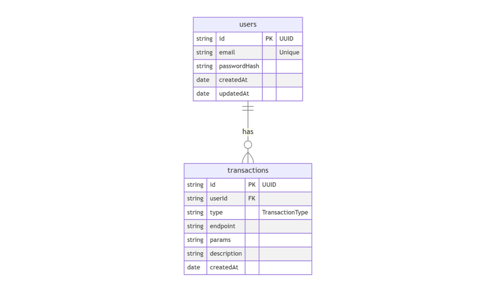

# Tyba Backend Test. By: Luis Alejandro Bravo Ferreira

## Overview

This project is a RESTful API built with NestJS that provides authentication, restaurant search, and transaction logging functionality. The application follows a clean architecture approach with distinct layers for domain, application, infrastructure, and interfaces.

## Architecture

The application implements a **Hexagonal Architecture** (also known as Ports and Adapters pattern), which is a form of Clean Architecture. This architectural style isolates the core business logic from external concerns, making the system more maintainable, testable, and adaptable to change.

<p align="center">
  
</p>

### Architectural Benefits

- **Technology Independence**: The domain and application layers are isolated from infrastructure concerns, allowing for framework, database, or external service changes with minimal impact on business logic.
- **Testability**: Business logic can be tested without external dependencies.
- **Flexibility**: New features can be added without modifying existing code (Open/Closed Principle).
- **Maintainability**: Clear separation of concerns makes the codebase easier to understand and maintain.
- **Scalability**: Components can be scaled or replaced independently as needed.

### Domain Layer
- **Entities**: Core business objects (User, Restaurant, Transaction)
  - Immutable objects with private properties and getters
  - Factory methods for creation and reconstitution
  - Encapsulate business logic and validation rules
- **Repositories**: Interfaces for data access
  - Define contracts for persistence operations
  - Allow for dependency inversion

### Application Layer
- **Services**: Implementation of business logic
  - Auth Service: User authentication, registration, and token management
  - Restaurant Service: Restaurant search functionality using location data
  - Transaction Service: Transaction logging and retrieval
  - Orchestrate domain entities and repositories
  - Implement use cases without knowledge of external systems

### Infrastructure Layer
- **Repositories**: Concrete implementations of repository interfaces
  - Adapter pattern to connect domain with external systems
  - Translation between domain entities and ORM entities
- **TypeORM**: Database connection and configuration
  - Entity definitions for database mapping
  - Migration management
- **Mappers**: Mapper implementations for transforming data between domain and ORM entities

### Interfaces Layer
- **Controllers**: API endpoints
  - Request handling and response formatting
  - Input validation using DTOs
  - Swagger documentation
- **DTOs**: Data Transfer Objects for request/response validation
  - Input validation with class-validator
  - Response structure standardization
  - API documentation with Swagger decorators

## Database Entities

The application uses TypeORM to map domain entities to database tables. The main database entities are:

<p align="center">
  
</p>

### User Entity

The User entity represents registered users in the system and is stored in the `users` table:

```typescript
@Entity('users')
export class UserEntity {
  @PrimaryColumn()
  id: string;

  @Column({ unique: true })
  email: string;

  @Column()
  passwordHash: string;

  @CreateDateColumn()
  createdAt: Date;

  @UpdateDateColumn()
  updatedAt: Date;
}
```

Key characteristics:
- UUID as primary key for better security and distribution
- Unique email constraint to prevent duplicate accounts
- Securely hashed passwords (never stored in plain text)
- Automatic timestamp tracking for creation and updates

### Transaction Entity

The Transaction entity logs all API requests and is stored in the `transactions` table:

```typescript
@Entity('transactions')
export class TransactionEntity {
  @PrimaryColumn()
  id: string;

  @Column()
  userId: string;

  @Column({
    type: 'varchar',
    length: 20,
    default: TransactionType.TRANSACTION
  })
  type: string;

  @Column()
  endpoint: string;

  @Column({ type: 'text' })
  params: string;

  @Column()
  description: string;

  @CreateDateColumn()
  createdAt: Date;
}
```

Key characteristics:
- UUID as primary key
- Association with users for tracking who performed actions
- Transaction type classification
- Storage of endpoint path and request parameters
- Descriptive information about the transaction
- Automatic timestamp for audit trail

### Database Schema Separation

The database entities are intentionally separate from domain entities to:
- Prevent ORM-specific annotations from polluting the domain model
- Allow the domain model to evolve independently from database schema
- Enable different persistence strategies without changing domain logic
- Support the clean architecture's separation of concerns principle

## Design Decisions

### Architectural Style: Hexagonal Architecture
The project uses Hexagonal Architecture because:
- It allows the core business logic to remain isolated from external dependencies
- It enables easier testing through dependency inversion
- It facilitates future changes to infrastructure without affecting business rules

### Layered Architecture Benefits
The separation into distinct layers provides specific advantages:

- **Domain-Infrastructure Separation**: Enables changing database providers, ORM frameworks, or external APIs without modifying business logic
- **Application-Interface Separation**: Allows adding new interfaces (e.g., GraphQL, gRPC, CLI) without changing the core application logic
- **Domain-Application Separation**: Business rules remain pure and can be reused across different applications
- **Infrastructure Abstraction**: Implementation details are hidden behind interfaces, making it easier to swap technologies or upgrade versions
- **Technology Evolution**: The system can evolve with changing technology trends without complete rewrites

### Monolithic Approach
The application is structured as a monolith rather than microservices because:
- Simpler initial development and deployment
- Lower operational complexity
- Easier debugging and testing
- Suitable for the current scale of the application
- Can be refactored into microservices later if needed

### ORM Selection: TypeORM
TypeORM was chosen as the database abstraction layer because:
- Strong TypeScript integration with decorators and type safety
- Support for multiple database systems (PostgreSQL, MySQL, etc.)
- Migration capabilities for database versioning
- Repository pattern support that aligns with the clean architecture approach
- Active community and good documentation

### Database choice: PostgreSQL
The database choice was PostgreSQL because:
- It is a powerful, open-source relational database that is widely used in the industry
- It provides a robust set of features and a strong ecosystem
- It is well-suited for the application's requirements
- It can easily be changed to another database if needed

### Authentication Strategy: JWT
JWT-based authentication was selected because:
- Stateless nature fits well with RESTful APIs
- Reduces database lookups for authentication
- Provides a secure way to transmit claims between parties
- Easily integrates with various frontend frameworks

### External API Integration
The application uses adapter interfaces for external API integration, which:
- Isolates the core application from external service implementation details
- Allows for easy mocking in tests
- Enables switching to different providers with minimal code changes

## Design Patterns

The project implements several design patterns:

1. **Repository Pattern**: Abstracts data access logic behind interfaces
2. **DTO Pattern**: Structures input/output data and provides validation
3. **Adapter Pattern**: Connects domain with external services
4. **Factory Method**: Creates domain entities with proper validation
5. **Dependency Injection**: Manages component dependencies
6. **Guard Pattern**: Protects routes with authentication

## Control Flow Example

A typical request flow (e.g., user registration):

1. `AuthController` receives HTTP request with user data
2. Data is validated through `RegisterUserDto`
3. `AuthController` calls `AuthService.register()`
4. `AuthService` verifies user doesn't exist, hashes password, creates `User`
5. `UserRepository` is called to persist the user
6. `UserRepositoryImpl` converts domain entity to ORM entity and saves to database
7. Response is formatted and returned to client

## Tech Stack

- **Framework**: NestJS (Node.js)
- **Language**: TypeScript
- **Database**: PostgreSQL
- **ORM**: TypeORM
- **Authentication**: JWT (JSON Web Tokens)
- **API Documentation**: Swagger/OpenAPI
- **Testing**: Jest
- **Containerization**: Docker & Docker Compose
- **Validation**: class-validator
- **HTTP Client**: axios
- **Bcrypt**: For password hashing
- **Overpass Turbo API**: For restaurant search

## Code Quality and Best Practices

This project follows several best practices:

1. **Clean Architecture**: Separation of concerns with distinct layers
2. **SOLID Principles**: Single responsibility, Open/closed, Liskov substitution, Interface segregation, Dependency inversion
3. **DTO Pattern**: Data Transfer Objects for request/response validation
4. **Repository Pattern**: Abstraction of data access logic
5. **Dependency Injection**: NestJS built-in DI container
6. **Middleware**: Request logging and transaction tracking
7. **Global Exception Handling**: Centralized error handling
8. **Environment Configuration**: Separation of configuration from code
9. **API Documentation**: Swagger/OpenAPI specification
10. **Containerization**: Docker for consistent development and deployment environments
11. **Hashing**: Bcrypt for password hashing
12. **Testing**: Jest for unit and integration tests
13. **TypeORM**: Database abstraction layer
14. **TypeScript usage**: Static type system for better code quality and maintainability
15. **Mapper Pattern**: Mapper implementations for transforming data between domain and ORM entities
16. **Git Ignore**: .env file is not added to the repository, as well as dist files and node_modules folder.

## Features

1. **Authentication**
   - User registration
   - User login
   - JWT-based authentication

2. **Restaurant Search**
   - Search for restaurants by location (latitude/longitude)
   - Integration with external restaurant API (Using Overpass Turbo API https://overpass-api.de/)

3. **Transaction Logging**
   - Automatic logging of all API requests
   - Transaction history retrieval

## API Endpoints

The API includes the following endpoints:

- **Auth**
  - POST /auth/register - Register a new user
  - POST /auth/login - Authenticate a user
  - POST /auth/logout - Logout a user
  - GET /auth/profile - Get the current user profile

- **Restaurants**
  - GET /restaurants - Find restaurants using a lat/long or a City name

- **Transactions**
  - GET /transactions - Get transaction history for the current user

### API Documentation

The API documentation is available via Swagger UI at:
```
http://localhost:3000/api-docs
```

## Token Management

The application implements a stateless JWT authentication system:

- **Storage**: Tokens are stored client-side with an in-memory blacklist for revoked tokens
- **Implementation**: Uses NestJS JwtService and Passport-JWT strategy
- **Security**: Tokens contain user ID and email, with configurable expiration (default: 1h)
- **Validation**: JwtAuthGuard protects routes, JwtStrategy validates tokens and checks blacklist
- **Limitation**: In-memory blacklist clears on server restart (Redis is recommended for production or a more robust solution)


## Getting Started

### Prerequisites

- Node.js (v18+)
- Docker and Docker Compose
- Git

### Installation

1. Clone the repository:
   ```bash
   git clone <repository-url>
   cd tyba-backend-test
   ```
Remember that everything is inside the api folder.

2. Set up environment variables:
   ```bash
   cp api/.env.example api/.env
   ```
   
   Edit the `.env` file with your configuration. Use the .env.example file as a reference.
   ```
    # Application
    PORT=3000
    NODE_ENV=development

    # Database
    DATABASE_HOST=localhost # Use db for docker-compose, localhost for local
    DATABASE_PORT=5432
    DATABASE_USER=your-username
    DATABASE_PASSWORD=your-password
    DATABASE_NAME=defaultdb
    DATABASE_SSL_MODE=prefer

    # JWT
    JWT_SECRET=your-secret-key
    JWT_EXPIRATION=1h 
   ```

### Running with Docker

The easiest way to run the application is using Docker Compose from the root folder:

```bash
docker-compose up
```

This will start both the API service and a PostgreSQL database instance. The API will be available at http://localhost:3000.

### Running Locally

1. Install dependencies:
   ```bash
   cd api
   npm install
   ```

2. Start the application:
   ```bash
   npm run start
   ```

## Testing

The project includes both unit and integration tests:

### Running All Tests

```bash
cd api
npm test
```

### Running Unit Tests

```bash
npm run test:unit
```

### Running Integration Tests

```bash
npm run test:integration
```

## Project Structure

The project is structured as follows:

```
/
├── api/                 # NestJS API service
│   ├── dist/            # Compiled JavaScript files
│   ├── src/
│   │   ├── application/ # Application services
│   │   └── services/
│   │       ├── auth/    # Authentication service
│   │       ├── restaurant/ # Restaurant service
│   │       └── transaction/ # Transaction service
│   │   ├── common/      # Shared utilities, pipes, middlewares
│   │   ├── config/      # Configuration
│   │   ├── domain/      # Domain entities and repositories
│   │   │   ├── entities/
│   │   │   └── repositories/
│   │   ├── infrastructure/ # External services and data access
│   │   │   ├── mappers/
│   │   │   ├── repositories/
│   │   │   └── typeorm/
│   │   ├── interfaces/  # Controllers, DTOs
│   │   │   ├── controllers/
│   │   │   └── dtos/
│   │   ├── app.controller.ts
│   │   ├── app.module.ts
│   │   ├── app.service.ts
│   │   └── main.ts
│   ├── test/            # Test files
│   │   ├── README.md    # Test documentation
│   │   ├── integration/ # Integration tests
│   │   └── unit/        # Unit tests
│   ├── .env             # Environment variables
│   ├── .env.example     # Example environment variables
│   ├── Dockerfile       # Docker configuration
│   ├── jest.config.integration.js # Jest configuration for integration tests
│   ├── jest.config.unit.js # Jest configuration for unit tests
│   ├── package.json     # Project dependencies and scripts
│   └── tsconfig.json    # TypeScript configuration
├── docker-compose.yml    # Docker Compose configuration (API and DB)
└── README.md            # Project documentation
```
